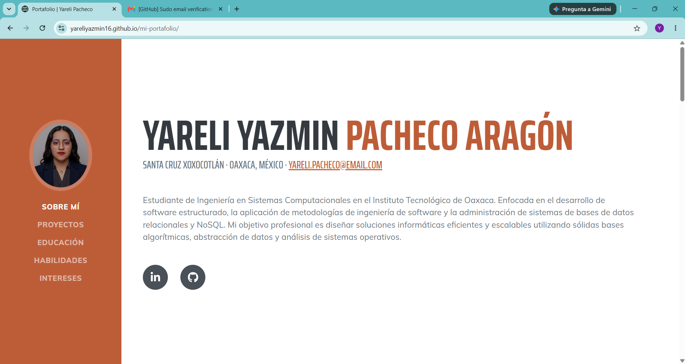
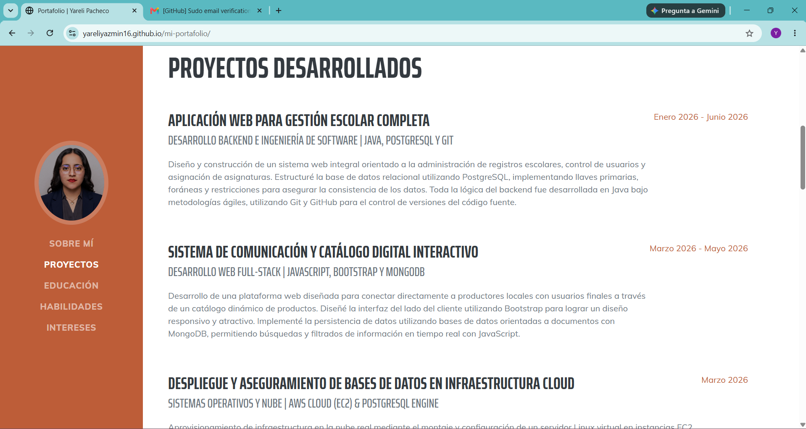
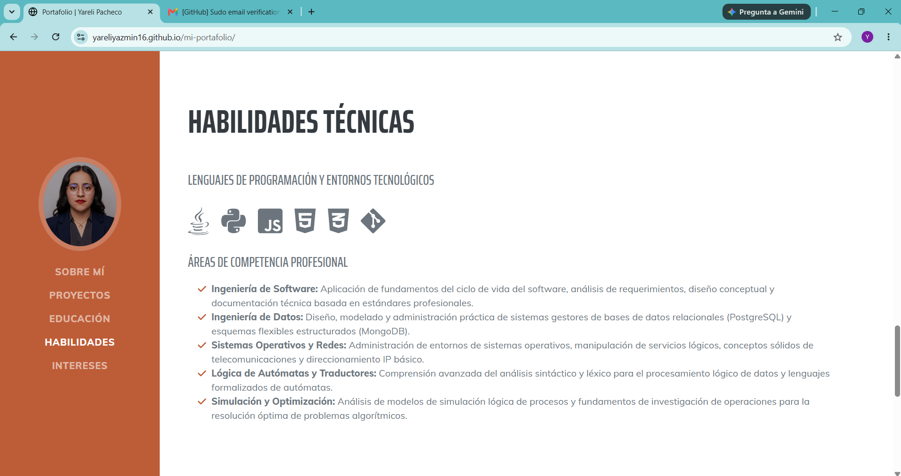
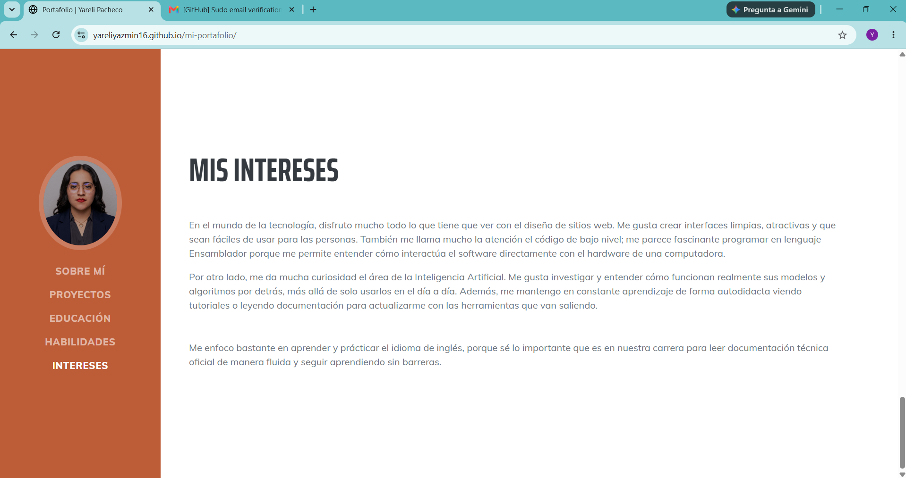

# INSTITUTO TECNOLÓGICO NACIONAL DE MÉXICO
## INSTITUTO TECNOLÓGICO DE OAXACA

**Nombre de la carrera:**  
Ingeniería en Sistemas Computacionales  

**Nombre de la materia:**  
Programación web  

**Título del trabajo:**  
Portafolio de Evidencias Web (Basado en Plantilla Bootstrap)  

**Alumno:**  
Pacheco Aragón Yareli Yazmin (N.C. 23161067)  

**Docente:**  
Adelina Martinez Nieto  

**Grupo:** 7SC 

**Fecha de entrega:**  
07 Julio 2026  

---

##  Descripción del Proyecto
Este proyecto consiste en el diseño, personalización y despliegue en vivo de un portafolio web profesional e individual, adaptado a partir de una plantilla libre de internet. En el portafolio se describe mi formación académica, competencias técnicas y proyectos desarrollados en la carrera de ingeniería.

* **Framework CSS Utilizado:** Bootstrap v5.2.3
* **Plantilla Base:** Start Bootstrap - Resume
* **Enlace de Descarga de la Plantilla:** [https://github.com/startbootstrap/startbootstrap-resume](https://github.com/startbootstrap/startbootstrap-resume)

###  Secciones que Componen el Portafolio
1. **Sobre Mí:** Breve introducción sobre mi perfil como estudiante de ingeniería en el Instituto Tecnológico de Oaxaca, metas y enfoque profesional.
2. **Proyectos:** Espacio que detalla el desarrollo de sistemas reales aplicados, como una plataforma de gestión escolar en Java y PostgreSQL, un catálogo interactivo con MongoDB y un módulo síncrono de inactividad.
3. **Educación:** Resumen cronológico de mi formación académica, detallando mi educación superior actual y mi bachillerato en el COBAO Plantel 32.
4. **Habilidades:** Visualización de lenguajes dominados (Java, Python, JS, HTML/CSS) y áreas de competencia como Autómatas, Ingeniería de Software y Sistemas Operativos.
5. **Intereses:** Redacción  que describe mi interés por el diseño web, el lenguaje Ensamblador, el funcionamiento interno de la IA y mi nivel de inglés B1.

---

##  Proceso de Creación 

A partir de los archivos fuente de la plantilla descargada, realicé el siguiente procedimiento para estructurar y adaptar el portafolio según los lineamientos requeridos:

1. **Descarga y Extracción:** Descargué el código original desde el repositorio de Start Bootstrap en formato zip y lo extraje en mi computadora.
2. **Reestructuración Limpia de Carpetas (Puntos de Rúbrica):** Tomé los archivos compilados de la carpeta dist. Cree una carpeta nueva en mi computadora y dentro de ella tres carpetas: `css/`, `js/` e `img/`.
3. **Migración y Renombrado de Archivos:** 
* Moví el archivo `index.html` a mi carpeta.
* Tomé el archivo original `styles.css` de la plantilla, lo pegué dentro de mi nueva carpeta `css` y lo renombré como `portafolio.css`.
* Tomé el archivo original `scripts.js`, lo pegué en mi carpeta `js` y lo renombré como `portafolio.js`.
4. **Modificación de Rutas en el `index.html`:** Para evitar que la página tuviera errores después de  renombrar los archivos de estilos y scripts, abrí el código en el editor y actualicé los enlaces de la siguiente manera:
* El CSS se cambió a: `<link href="css/portafolio.css" rel="stylesheet" />`
* El script  se cambió a: ``
5. **Personalización de Contenido Técnico:** Modifiqué cada bloque de texto y párrafo original de la plantilla para plasmar mi información real. 
7. **Integración de Fotografía Profesional:** Sustituí la imagen genérica de la barra de navegación lateral por una foto real propia (`img/imagenfoto.jpg`).

---

##  Capturas de Pantalla

A continuación, se anexan las muestras del portafolio web adaptado con mi informacion: 

### Vista de Perfil y Presentación Principal

### Vista del Portafolio de Proyectos 

### Vista de Formación Académica 
[alt text](cap/image2.png)

### Vista de Habilidades Técnicas

### Vista de Intereses

---

